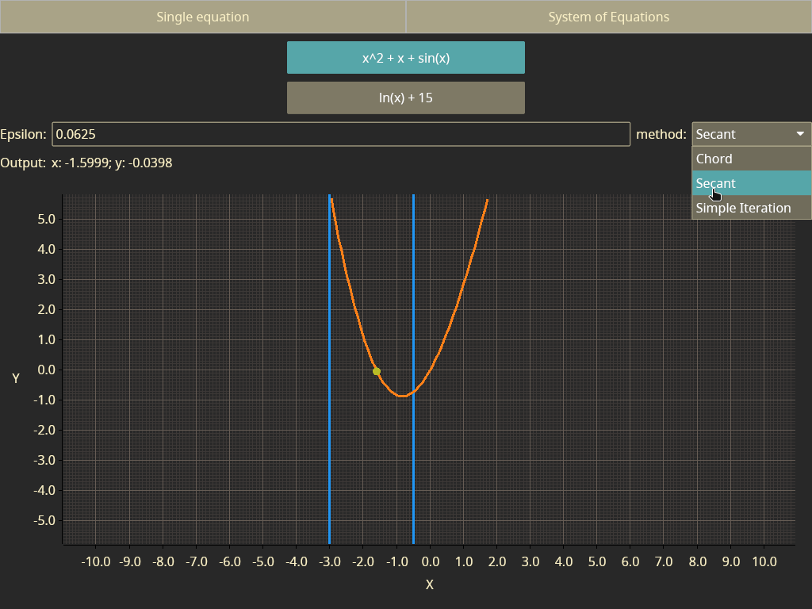

# Arduino Solver for Non-Linear equations and system of equations

## The... what?

So yeah, this is solver for non-linear equations implemented in rust for *Arduino*. I was challenged by my teacher to do this "just for fun" (took me 2 months to implement).

## The story

Idea was simple:

> -- So, you have an arduino at home? - professor asked
> 
> -- Yeah -- I replied
>
> -- So, can You do something with it... like, there should be buttons and... uh, a screen! Right, we need a screen! And as proposed by the assignment, the whole thing should solve Non-Linear equations.
>
> *Sounds not that complicated*
>
> -- I will do it

That is when all my problems ~~with this project~~ started.

## The final result

The final result is software and hardware system. 

### Overall look and hardware


### Closer look


### And the back side


### Application screenshots





## Features

- Implemented in ***Rust*** 🦀
- All computations happens on Arduino
- Computations uses 32-bit float point software implementation from avr-libc (written in Assembly)
  - ~~I would have killed myself if I had to implement trigonometric functions manually in assembly~~
- Initial approximations are controlled by physical buttons
- Buttons are handled asynchronously by Arduino via interrupts
- Buttons use pull down resistors (had to figure out whatah*ll this means)
- Arduino uses hardware timer to implement debounce function
- Arduino does not draw anything: just computes and sends data to the daemon
  - Turned out, arduino has only 2kb of RAM. This is definitely not enough to store even a single line of pixels for PC's display. 
- Communication between Arduino and Daemon happens via USART by custom binary protocol. For protocol reference see [architecture.md](./architecture.md)
- Code running on arduino essentially runs on *bare metal*: no libs except 32 bit float points implementation and basic HAL (names for registers)
- Custom implementation of `Lazy`, `RingBuffer` and `Usart` software abstraction. Everything written in rust
- Protocol supports synchronisation sequence, called *signature* 
- Daemon times requests to not flood arduino with messages
- Daemon is fully native! No webview, no Electron! Pure native experience, thanks to [Iced](https://github.com/iced-rs/iced)!
- Daemon is multithreaded application: main thread for GUI and a dedicated thread for connection with arduino
- Daemon draws a plot using [`plotters`](https://docs.rs/plotters/latest/plotters/) crate
- Function graphic is drawn by interpolating 256 function points within screen boundaries
- Application is interactive! No need to press *recompute* button: changes to inputs are detected and computations reevaluated on demand

# Building

Project has two compilable units:
- `arduino`
- `daemon`

## `arduino`

```shell
cd arduino
# unstable flags are configured in .cargo/config.toml
cargo build --release # without release flag compilation fails
# flash to arduino
avrdude -patmega328p -carduino -P <path-to-arduino> \
        -b115200 -D \
        -Uflash:w:../target/avr-unknown-gnu-atmega328/release/arduino.elf:e
```

## `daemon`

```shell
cd daemon
cargo build --release
../target/release/daemon
```

# From Idea to Implementation

https://github.com/user-attachments/assets/ff8903c5-750d-455f-b467-c37d2e30c2fb

- What data I need?
- Implement solver methods
- USART
- Lazy
- Why nothing works? (issue with interrupt numbers)
- Connection established
- Protocol implementation
- Daemon
- Something works
- Buttons
- Debounce buttons

The task was quite abstract. "Do something with arduino. It should has buttons and a screen".

To make project more interesting I decided that all computations should happen on arduino. This quite challenging, as I knew that arduino has not that much resources.

I had no screen for arduino, so I decided to use laptop as a screen. Soon, I realized that arduino has only 2KB of RAM. That is not enough to store even a single row of pixels of my laptops screen. Hence I chose to make my laptop a little bit smarter: let it not just draw pixels, but draw user interface and plot data received from arduino.

I determined what data I need to get from a user and what should application display to the user. Protocol was designed around this knowledge.

The most common way arduino communicates with PC is by USART over USB. As I used rust and decided to implement as much as possible by myself, I had to make software abstraction over USART. 


